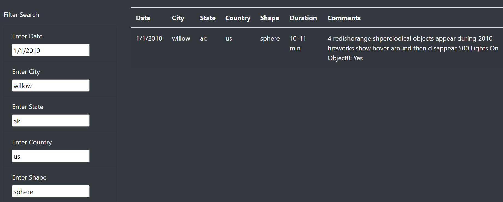

# UFO Sightings with Javascript
## Overview of the Analysis
This project allows users to filter criteria in order to learn more about UFO sightings. A webpage can be created by using JavaScipt, CSS, and HTML. Tables with UFO sightings data are stored in JavaScript arrays while CSS can style the layout of the web page created by HTML.

## Results
There are five criteria to help filter the data: date, city, state, country, and shape. Users are able to enter their criteria into the white text box in order to search for specific data. The following image shows an example if the following criteria were used:
- Date: 1/1/2010
- City: willow
- State: ak
- Country: us
- Shape: sphere

## Summary
To conclude, this web page is very user friendly in order to look up UFO sightings. There are suggestions for improvement though to make the data even more assessable to all!
- Drawback: The filter search bars are case sensitive
- Recommendations:
    - In addition to making the filter search bars not case sensitive, it would be beneficial to add a drop-down menu for users to select a specific sighting.
    - There should also be a clear filter button to reset the options.